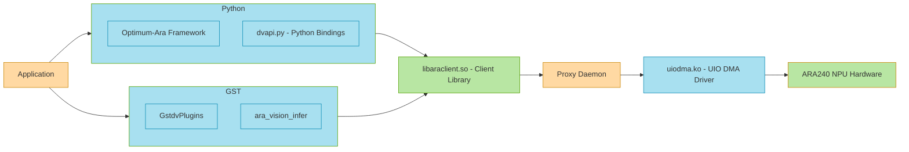

<div align="center">

# rt-sdk-ara2 ⚡

[](./LICENSE.txt)
[](https://www.nxp.com/products/processors-and-microcontrollers/arm-processors/i-mx-applications-processors:IMX_HOME)
[](https://www.nxp.com/docs/en/user-guide/IMX-MACHINE-LEARNING-UG.pdf)
[](https://www.nxp.com/design/design-center/software/embedded-software/i-mx-software/embedded-linux-for-i-mx-applications-processors:IMXLINUX)

</div>

Runtime SDK for AI/ML acceleration with Ara240 NPU on i.MX SoCs 🚀🧠💻

<div align="left">

## 📋 Table of Contents

- [Overview](#-overview)
- [Key Components](#-key-components)
- [Required Hardware](#-required-hardware)
- [Required Software](#-required-software)
- [Installation on i.MX](#%EF%B8%8F-installation-on-imx)
- [Getting Started](#-getting-started)
- [Helper Scripts](#-helper-scripts)
- [Python API and Optimum-Ara](#-python-api-and-optimum-ara)
- [GStreamer Plugins](#-gstreamer-plugins)
- [UIO DMA Driver](#-uio-dma-driver)
- [Package Components](#-package-components)
- [Release Notes](#-release-notes)
- [Licensing](#%EF%B8%8F-licensing)

---

## 🎯 Overview

The **rt-sdk-ara2** Debian package provides a complete runtime environment for AI/ML acceleration using the Ara240 NPU on NXP i.MX SoCs. This package includes:

- 🔧 **Runtime libraries** for Ara240 NPU integration
- 🐍 **Python bindings** (DVAPI) for custom inference applications
- 🤖 **Optimum-Ara framework** for LLMs and VLMs
- 🎥 **GStreamer plugins** for Real-Time Detection Object Applications
- 🛠️ **Helper scripts** for monitoring, benchmarking, and model management
- ⚙️ **Systemd service** for automatic hardware initialization
- 🚗 **UIO DMA driver** for PCIe communication

### Software Architecture

<div align="center">



<div align="left">

---

## 🔑 Key Components

This package integrates the following external components:

| **Component**       | **Repository**                                      | **License**       |
| ------------------- | --------------------------------------------------- | ----------------- |
| UIO DMA Driver      | https://github.com/nxp-imx-support/uiodma-driver    | GPL-2.0-only      |
| Optimum-Ara         | [Coming Soon]                                       | Apache-2.0        |
| GStreamer Plugins   | [Coming Soon]                                       | LGPL-2.1-or-later |

---

## 🧰 Required Hardware

- [i.MX 8M Plus FRDM](https://www.nxp.com/design/design-center/development-boards-and-designs/FRDM-IMX8MPLUS) / [i.MX 95 FRDM](https://www.nxp.com/design/design-center/development-boards-and-designs/FRDM-IMX95)
- [Ara240 NPU module](https://www.nxp.com/design/design-center/development-boards-and-designs/ARA240-16GB-M2-MODULE?_gl=1*1at1n92*_ga*MTc3OTgzNTQwMS4xNzcyNzM0MzY3*_ga_WM5LE0KMSH*czE3NzM0MzUxMTMkbzI3JGcwJHQxNzczNDM1MTEzJGo2MCRsMCRoMTE3MzM5MTI2MQ..)
- microSD card (≥ 64GB recommended for LLM/VLM support)
- USB-C debug cable
- Internet connection
- Power supply

---

## 💻 Required Software

- [Embedded Linux for i.MX](https://www.nxp.com/design/design-center/software/embedded-software/i-mx-software/embedded-linux-for-i-mx-applications-processors:IMXLINUX) (`== LF6.18.2_1.0.0`)
- [`rt-sdk-ara2_2.0.4.deb`](https://www.nxp.com/webapp/Download?colCode=RT-SDK-ARA2-2.0.4&appType=license) 

---

## 🛠️ Installation on i.MX

### Step 1: Set System Date and Time

Set the current date and time to avoid certificate issues during package downloads:

```bash
date -s "DD-MMM-YYYY HH:MM:SS"
```

**Example:**

```bash
date -s "1-APR-2026 00:00:00"
```

### Step 2: Transfer the Debian Package

Transfer `rt-sdk-ara2_2.0.4.deb` to your i.MX board using `scp`:

```bash
scp rt-sdk-ara2_2.0.4.deb root@<ip_addr>:
```

### Step 3: Install the Package

Install the package with automatic disk partition resizing for LLM support:

```bash
dpkg -i rt-sdk-ara2_2.0.4.deb
```

The installation process will:
- ⚙️ Configure systemd service (`rt-sdk-ara2.service`) for automatic startup
- 💾 Expand system partition to maximize storage capacity
- 🔧 Set up udev rules for Ara240 NPU detection
- 📦 Install all necessary libraries, scripts, and tools

### Step 4: Reboot the Board

**This is a critical step!** Reboot the board to load the driver and start the service:

```bash
reboot
```

Wait approximately **60-70 seconds** for the boot process to complete. You should see these log messages indicating successful initialization:

```
[   59.645245] bash[1051]: 2026-03-11 02:21:19 - Proxy launched succesfully
[   60.678728] bash[1059]: 2026-03-11 02:21:20 - Hardware bringup is done (1 device(s) configured) and proxy is launched successfully in the background.
[   60.679857] bash[868]: Logs saved in: /usr/share/rt-sdk-ara240/saved_logs/rt-sdk-ara2_logs.txt
```

> **Note:** The boot process includes loading the `uiodma.ko` driver, performing Ara240 hardware bringup, and launching the proxy daemon.

### Step 5: Verify Firmware Version

Check the installed firmware version (should be **131072**):

```bash
chip_info.sh
```

Look for the `firmware_version(raw)` field in the output:

```
| firmware_version(raw)       | 131072     |
| firmware_version            | 2.0.0      |
```

### Step 6: Update Firmware (if needed)

Firmware flashing is a one-time activity and persists across reboots. If the firmware version is **not 131072**, update it:

```bash
program_flash.sh
```

> **Important:** Always reboot the board after upda firmware to ensure the new version is properly loaded and initialized.

### Step 8: Verify Service Status (optional)

In order to ensure the installation was successful and all components are properly initialized, you can verify the service status with the following commands:

To check `rt-sdk-ara2.service` is running:

```bash
systemctl status rt-sdk-ara2.service --no-pager -l
```

To view detailed service logs:

```bash
journalctl -u rt-sdk-ara2.service
```

To verify the proxy is running:

```bash
ps -eaf | grep proxy_ara240
```

---

## 🚀 Getting Started

Once installation is complete, you can start using the Ara240 NPU with the included helper scripts and APIs.

> [!WARNING]
> At this point we recomend to switch to a SSH connection for the best experience.

### Download Sample Models

Download pre-compiled models for testing. Run the download script to get different flavours of YOLOv8 models.

```bash
fetch_models --repo-id nxp/YOLOv8
```

### Quick Performance Test

Run a quick performance benchmark on downloaded models:

```bash
run_model_perf.sh
```

Follow the interactive prompts to select a model category and specific model. The script will display performance metrics including **HW IPS** (Hardware Inferences Per Second), which indicates the speed of inference execution on the Ara240 NPU.

---

## 🔧 Helper Scripts

The SDK includes several helper scripts to monitor, manage, and benchmark the Ara240 NPU. These scripts make it easy to check device status, update firmware, download models, and run performance tests.

### ara2_metrics.sh - Monitor NPU Performance

Monitor real-time NPU metrics including utilization, temperature, DRAM usage, and device state:

```bash
ara2_metrics.sh
```

**Interactive menu options:**
- **1** - Print NPU utilization continuously
- **2** - Print device information
- **3** - Print DRAM information
- **4** - Print NPU temperature (one-time)
- **5** - Print NPU temperature continuously
- **6** - Print utilization, temperature, and DRAM continuously
- **7** - Print NPU state
- **0** - Exit

> **Use case:** This tool is invaluable during benchmarking or model execution. You can correlate model performance with thermal behavior and utilization to identify bottlenecks. For example, if performance drops, you can verify whether the NPU is throttling due to temperature or experiencing memory pressure.

### chip_info.sh - Device Summary

Get a comprehensive overview of the Ara240 NPU configuration and status:

```bash
chip_info.sh
```

**Displays:**
- Chip ID and revision
- Bus ID and interface type (PCIe)
- System, NPU, and DDR frequencies
- Device temperature and voltage
- Power state
- Firmware version (raw and display format)
- DDR and flash information
- Life cycle and chip part type

> **Note:** This script runs automatically twice during Ara240 boot-up and provides a quick health check of the device.

### program_flash.sh - Firmware Update

Update the Ara240 NPU firmware to the required version:

```bash
program_flash.sh
```

> **Important:** Always reboot the board after running this script to ensure the new firmware is fully applied and the device state is clean.

### fetch_models - Download Pre-compiled Models

Download pre-trained (CNN/LLM) models from Hugging Face Hub for use with the ARA240 platform.

```bash
fetch_models --list
```

This command shows all supported models available to fetch from Hugging Face.

**Supported models:**

- LLMs/VLMs:
   - Qwen2.5-7B-Instruct (For Ara240)
   - Qwen2.5-Coder-1.5B (For Ara240)
   - Qwen2.5-VL-7B-Instruct (For Ara240)
- YOLOv8:
   - detection:
      - yolov8n
      - yolov8n-face
      - yolov8s
      - yolov8m
      - yolov8l
      - yolov8x
   - pose:
      - yolov8n-pose
      - yolov8s-pose
      - yolov8m-pose
      - yolov8l-pose
      - yolov8x-pose
   - segmentation:
      - yolov8n-seg
      - yolov8s-seg
      - yolov8m-seg
      - yolov8l-seg
      - yolov8x-seg

### run_model_perf.sh - Performance Benchmarking

Run performance benchmarks on downloaded models:

> [!WARNING]
> We strongly recommend using an SSH connection rather than *console/UART/debug cable* communication when running the benchmark. Console-based connections can introduce significant performance degradation due to the high volume of printed output, leading to unrealistic or misleading benchmark results.

```bash
run_model_perf.sh
```

**Example output:**

```
==========================
Available Model Categories
==========================
  1) detection
  2) pose
  3) segmentation
  q) Quit
Enter the number corresponding to the category you want to explore: 1
==========================
Available Models in detection
==========================
1. yolov8n
```

**Key metric:** Look for **HW IPS** (Hardware Inferences Per Second) in the results. This represents the maximum throughput the Ara240 NPU can achieve for the selected model under current conditions.

> **Note:** IPS values may vary depending on thermal conditions, system load, interface type (PCIe), and whether the benchmark runs continuously or in bursts.

**Customizing benchmark parameters:**

By default, the script runs with:
- **Iterations:** 1000
- **Batch size:** 10

To modify these parameters, edit the script variables in `run_model_perf.sh`:

```bash
NUM_ITERATIONS="0.iterations=1000"  # Change to desired number of iterations
BATCH_SIZE="0.batch_size=10"        # Change to desired batch size
```

**Results location:**

Performance logs are saved to:
```
/usr/share/rt-sdk-ara240/saved_logs/<category>_<model>_perf_log.txt
```

Device statistics are dumped to:
```
/usr/share/rt-sdk-ara240/saved_logs/device_stats/
```

### Service Management

The `rt-sdk-ara2.service` is enabled by default and handles:
- Loading the `uiodma.ko` kernel driver
- Performing hardware bringup
- Launching the proxy daemon

**Check service status:**

```bash
systemctl status rt-sdk-ara2.service --no-pager -l
```

**Restart the service:**

```bash
systemctl restart rt-sdk-ara2.service
```

**Disable automatic startup (not recommended):**

```bash
systemctl disable rt-sdk-ara2.service
```

**View detailed logs:**

```bash
journalctl -u rt-sdk-ara2.service
```

---

## 📚 Python API and Optimum-Ara

### DVAPI Python Bindings

The SDK includes Python bindings for the DVAPI (DeepVision API):

**Location:** `/usr/share/rt-sdk-ara240_2.0.4/include/dvapi.py`

**Key classes and methods:**
- `DVSession` - Session management for Ara240 NPU
- `DVModel` - Model loading and management
- `DVEndpoint` - Endpoint (device) management
- `dv_infer_wait_for_completion()` - Blocking inference execution

### Optimum-Ara Framework

Optimum-Ara is a framework for running Large Language Models (LLMs) and Vision-Language Models (VLMs) on Ara240.

**Location:** `/usr/share/rt-sdk-ara240_2.0.4/optimum-ara/`

**Repository:** [Coming Soon]

**License:** Apache-2.0

**Supported models:**
- **LLMs:** Qwen2.5-7B-Instruct, Qwen2.5-Coder-1.5B
- **VLMs:** Qwen2.5-VL-7B-Instruct

---

## 🎥 GStreamer Plugins

The package includes custom GStreamer plugins optimized for zero-copy video inference pipelines with the Ara240 NPU.

**Location:** `/usr/lib/gstreamer-1.0/`

**Repository:** [Coming Soon]

**License:** LGPL-2.1-or-later

### Available Plugins

1. **libgstdvPre.so** - Pre-processing plugin
   - Handles image preprocessing (resizing, normalization, color conversion)
   - Zero-copy buffer operations for optimal performance

2. **libgstdvInf.so** - Inference plugin
   - Executes inference on Ara240 NPU
   - Manages model loading and execution

3. **libgstdvPost.so** - Post-processing plugin
   - Processes inference results
   - Prepares output for visualization or further processing

---

## 🚗 UIO DMA Driver

The **uiodma.ko** kernel driver enables high-speed PCIe communication between the i.MX host processor and the Ara240 NPU module.

**Location:** `/usr/share/rt-sdk-ara240_2.0.4/driver/`

**Repository:** https://github.com/nxp-imx-support/uiodma-driver

**License:** GPL-2.0-only

### Driver Information

The driver is automatically loaded during system boot by the `rt-sdk-ara2.service`. You can verify it's loaded with:

```bash
lsmod | grep uiodma
```

To manually load the driver:

```bash
insmod /usr/share/rt-sdk-ara240_2.0.4/driver/uiodma.ko
```

To manually unload the driver:

```bash
rmmod uiodma
```

> **Note:** The driver is essential for Ara240 NPU operation. Do not unload it while running inference workloads.

---

## 📦 Package Components

The Debian package installs components to the following locations:

### Binaries and Scripts
- `/usr/share/rt-sdk-ara240_2.0.4/scripts/` - All utility scripts
- `/usr/share/rt-sdk-ara240_2.0.4/scripts/ara2_metrics_bin/` - Hardware metrics binary

### Libraries
- `/usr/lib/libaraclient_aarch64.so` - Ara client library
- `/usr/lib/libara_vision_inference.so*` - Vision inference library
- `/usr/lib/gstreamer-1.0/` - GStreamer plugins for video inference pipelines

### Headers and Python Modules
- `/usr/include/sdk_ara/` - C/C++ headers (dvapi.h, dv_status_codes.h, etc.)
- `/usr/share/rt-sdk-ara240_2.0.4/include/` - Python bindings (dvapi.py)

### Runtime Artifacts
- `/usr/share/rt-sdk-ara240_2.0.4/optimum-ara/` - Optimum-Ara framework, examples, and documentation
- `/usr/share/rt-sdk-ara240_2.0.4/hw_utils/` - Hardware utilities and firmware
- `/usr/share/rt-sdk-ara240_2.0.4/proxy/` - Proxy daemon

### System Configuration
- `/etc/systemd/system/rt-sdk-ara2.service` - Systemd service
- `/etc/udev/rules.d/99-ara2.rules` - Udev rules for NPU detection
- `/etc/rt-sdk-ara240/` - Configuration files (proxy_config.yaml, cnn_config.yaml)

### Drivers
- `/usr/share/rt-sdk-ara240_2.0.4/driver/` - UIO DMA driver

---

## 📝 Release Notes

### Version Information

| **Component**      | **Version** |
| ------------------ | ----------- |
| Kinara SDK         | r2.0.4      |
| ara-client         | r1.3.2.0    |
| proxy              | 1.4.0.0     |
| Debian package     | v2.0.4      |
| Firmware (raw)     | 131072      |
| Firmware (display) | 2.0.0       |

### Related Projects

The following projects depend on this SDK:

| **Project**              | **Repository** | **Version/Tag** |
| ------------------------ | -------------- | ------------------ |
| eiq-aaf-connector        | https://github.com/nxp-imx-support/eiq-aaf-connector    | main |
| ara2-vision-examples     | https://github.com/nxp-imx-support/ara2-vision-examples | lf-6.18.2-1.0.0_Q1-2026 |
| LLM-Edge-Studio          | https://github.com/nxp-imx-support/llm-edge-studio      | v2.0.0 |
| VLM-Edge-Studio          | https://github.com/nxp-imx-support/vlm-edge-studio      | v1.0.0 |

---

## ⚖️ Licensing

This repository is licensed under the [LA_OPT_NXP_Software_License](./LICENSE.txt) license.

### Licensing and Copyright in Debian Package

- **Software Bill of Materials (SBOM):** `/usr/share/doc/rt-sdk-ara2/SBOM-rt-sdk-ara2-2.0.4.spdx.json`
- **License files:** `/usr/share/doc/rt-sdk-ara2/LICENSE.txt`

---

<div align="center">

**For support and additional information, please refer to the official NXP documentation.**

</div>
